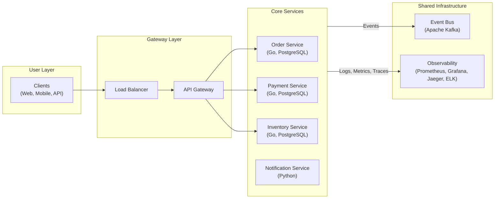

# 🏪 EventFlow Commerce

[](https://github.com/Kalaganov-Konstantin/eventflow-commerce/actions/workflows/main.yml)
[](https://codecov.io/gh/Kalaganov-Konstantin/eventflow-commerce)

**Go Report Cards:**
[](https://goreportcard.com/report/github.com/Kalaganov-Konstantin/eventflow-commerce/services/api-gateway)
[](https://goreportcard.com/report/github.com/Kalaganov-Konstantin/eventflow-commerce/services/order)
[](https://goreportcard.com/report/github.com/Kalaganov-Konstantin/eventflow-commerce/services/payment)
[](https://goreportcard.com/report/github.com/Kalaganov-Konstantin/eventflow-commerce/services/inventory)
[](https://goreportcard.com/report/github.com/Kalaganov-Konstantin/eventflow-commerce/shared/libs)

## ✨ Project Overview

**EventFlow Commerce** is a fully-featured, distributed e-commerce platform built to showcase a modern, cloud-native
architecture. It serves as a practical, hands-on demonstration of how to design, build, and operate a complex,
resilient, and scalable system using cutting-edge, production-ready technologies.

This project is not just about code; it's a comprehensive portfolio piece that illustrates advanced concepts in
microservices, event-driven design, and DevOps. It's designed to be a reference for engineers and a testament to the
skills required to build robust, enterprise-grade applications.

## 🚀 Key Features

- **Event-Driven Architecture** with Apache Kafka for maximum decoupling and scalability.
- **Saga Pattern** for maintaining data consistency across distributed transactions.
- **Event Sourcing & CQRS** for a fully auditable and high-performance payment service.
- **Advanced CI/CD** with automated **Canary Releases** using Istio for zero-downtime deployments.
- **Comprehensive Observability** with the "three pillars": metrics (Prometheus), logs (ELK), and traces (Jaeger).
- **Resilient by Design** with built-in Circuit Breakers and Fallback mechanisms.
- **Polyglot Persistence** using the best database for the job (PostgreSQL, Redis).
- **Secure by Default** with automatic mTLS encryption for all internal traffic provided by Istio.

## 🛠️ Technology Stack

| Category             | Technology                                                                                                                |
|:---------------------|:--------------------------------------------------------------------------------------------------------------------------|
| **Languages**        | [Go](https://golang.org/), [Python](https://www.python.org/)                                                              |
| **Service Mesh**     | [Istio](https://istio.io/)                                                                                                |
| **Event Bus**        | [Apache Kafka](https://kafka.apache.org/)                                                                                 |
| **Databases**        | [PostgreSQL](https://www.postgresql.org/), [Redis](https://redis.io/)                                                     |
| **Containerization** | [Docker](https://www.docker.com/), [Kubernetes](https://kubernetes.io/)                                                   |
| **Observability**    | [Prometheus](https://prometheus.io/), [Grafana](https://grafana.com/), [Jaeger](https://www.jaegertracing.io/), ELK Stack |
| **CI/CD**            | [GitHub Actions](https://github.com/features/actions)                                                                     |

## ⚡ Quick Start

```bash
# Clone and run
git clone https://github.com/Kalaganov-Konstantin/eventflow-commerce
cd eventflow-commerce
make demo

# Access services
# API Gateway: http://localhost:8080
# Grafana: http://localhost:3000
# Jaeger: http://localhost:16686
```

## 🏗️ Architecture

The architecture of EventFlow Commerce is designed to be scalable, resilient, and maintainable. Below is a high-level
overview. For a more detailed exploration of our architectural patterns, ADRs, and diagrams, please see our *
*[Architecture Documentation](./docs/architecture/README.md)**.



## 📚 Documentation

For full project documentation, please see the `/docs` directory:

- **[Architecture Deep Dive](./docs/architecture/README.md)**: A detailed look at all architectural patterns and
  diagrams.
- **[API Reference](./docs/api/README.md)**: OpenAPI specifications for our services.
- **[Developer Guides](./docs/guides/)**: Instructions for development, deployment, and more.

## 🧪 Testing

```bash
make test           # Run unit tests
make test-integration # Run integration tests
make test-e2e       # Run end-to-end tests
make test-performance # Run performance tests
```

## 🤝 Contributing

Contributions are welcome! Please see our **[Contributing Guide](./CONTRIBUTING.md)** for more details.

## 📄 License

This project is licensed under the MIT License - see the [LICENSE](./LICENSE) file for details.
