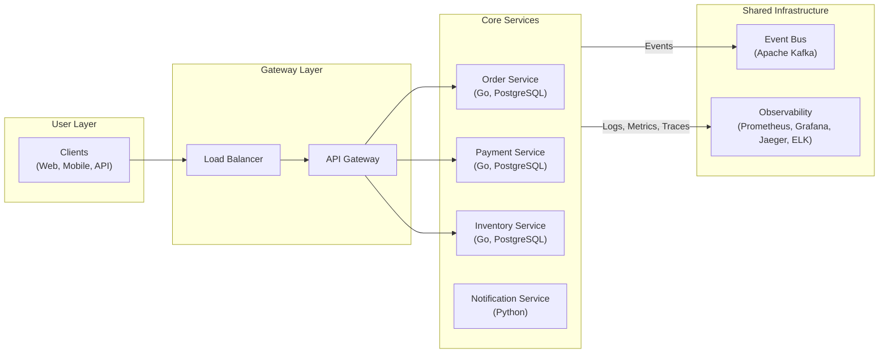

# 🏪 EventFlow Commerce

[](https://github.com/Kalaganov-Konstantin/eventflow-commerce/actions/workflows/main.yml)
[](https://codecov.io/gh/Kalaganov-Konstantin/eventflow-commerce)
[](https://golang.org/)
[](https://www.python.org/)
[](./infrastructure/k8s)
[](./LICENSE)

## ✨ Project Overview

**EventFlow Commerce** is a fully-featured, distributed e-commerce platform built to showcase a modern, cloud-native
architecture. It serves as a practical, hands-on demonstration of how to design, build, and operate a complex,
resilient, and scalable system using cutting-edge, production-ready technologies.

This project is not just about code; it's a comprehensive portfolio piece that illustrates advanced concepts in
microservices, event-driven design, and DevOps. It's designed to be a reference for engineers and a testament to the
skills required to build robust, enterprise-grade applications.

## 🚀 Key Features

- **Event-Driven Architecture** with Apache Kafka: every domain event goes through a transactional
  outbox, so a state change and the event announcing it always commit together.
- **Saga Pattern**: order creation reserves stock synchronously, then hands off to a choreography
  over Kafka between order, payment and inventory, with a saga state machine driving compensation
  when a later step fails.
- **Event Sourcing & CQRS** in the payment service: every payment is an append only event stream
  with a read model projected for queries.
- **Canary Releases** on the API Gateway, staged through Istio traffic weights with automated
  rollback on an error rate breach (`scripts/canary.sh`); the other services route through a single
  stable subset for now.
- **Observability** with the "three pillars": metrics (Prometheus/Grafana), traces (OTLP to Jaeger),
  and logs (ELK, opt-in behind the `logging` Compose profile, see `make logging-up`).
- **Resilient by Design** with circuit breakers guarding calls from the API Gateway to each backend
  and from the payment service to its (stub) gateway, failing fast instead of hanging when a
  dependency is unhealthy.
- **Polyglot Persistence** using the best database for the job (PostgreSQL, Redis).
- **mTLS between services** when deployed on the Istio-enabled Kubernetes manifests in
  `infrastructure/`; the local Docker Compose stack does not run a mesh.

The payment gateway and SMS delivery have no real external provider behind them: the payment
gateway is a deterministic stub (approves or declines based on the amount) and the SMS sender only
logs and marks the notification sent. Email notifications do send through a real SMTP client, given
working `SMTP_*` credentials.

## 🛠️ Technology Stack

| Category             | Technology                                                                                                                |
|:---------------------|:--------------------------------------------------------------------------------------------------------------------------|
| **Languages**        | [Go](https://golang.org/), [Python](https://www.python.org/)                                                              |
| **Service Mesh**     | [Istio](https://istio.io/)                                                                                                |
| **Event Bus**        | [Apache Kafka](https://kafka.apache.org/)                                                                                 |
| **Databases**        | [PostgreSQL](https://www.postgresql.org/), [Redis](https://redis.io/)                                                     |
| **Containerization** | [Docker](https://www.docker.com/), [Kubernetes](https://kubernetes.io/)                                                   |
| **Observability**    | [Prometheus](https://prometheus.io/), [Grafana](https://grafana.com/), [Jaeger](https://www.jaegertracing.io/), ELK Stack |
| **CI/CD**            | [GitHub Actions](https://github.com/features/actions)                                                                     |

## ⚡ Quick Start

Prerequisites: Docker with the Compose plugin (or standalone `docker-compose`), Go 1.25+, Python
with [uv](https://docs.astral.sh/uv/), and `jq` (the Makefile uses it to iterate the Go workspace).

```bash
# Clone and run
git clone https://github.com/Kalaganov-Konstantin/eventflow-commerce
cd eventflow-commerce
make demo

# Access services
# API Gateway: http://localhost:8080
# Grafana:     http://localhost:3000 (admin/admin)
# Prometheus:  http://localhost:9090
# Jaeger UI:   http://localhost:16686
# Kafka UI:    http://localhost:8090
# Alertmanager: http://localhost:9093

# Kibana needs the logging profile, which make demo does not start by default:
# make logging-up
# Kibana:      http://localhost:5601
```

## 🏗️ Architecture

The architecture of EventFlow Commerce is designed to be scalable, resilient, and maintainable. Below is a high-level
overview. For a more detailed exploration of our architectural patterns, ADRs, and diagrams, please see our *
*[Architecture Documentation](./docs/architecture/README.md)**.


```mermaid
graph LR
    subgraph "User Layer"
        CLIENTS["Clients<br>(Web, Mobile, API)"]
    end

    subgraph "Gateway Layer"
        LB["Load Balancer"]
        GW["API Gateway"]
    end

    subgraph "Shared Infrastructure"
        KAFKA["Event Bus<br>(Apache Kafka)"]
        OBS["Observability<br>(Prometheus, Grafana, Jaeger, ELK)"]
    end

    CLIENTS --> LB --> GW

    subgraph Services [Core Services]
        direction TB
        OS["Order Service<br>(Go, PostgreSQL)"]
        PS["Payment Service<br>(Go, PostgreSQL)"]
        IS["Inventory Service<br>(Go, PostgreSQL)"]
        NS["Notification Service<br>(Python)"]
    end

    GW --> OS
    GW --> PS
    GW --> IS
    Services -- " Events " --> KAFKA
    Services -- " Logs, Metrics, Traces " --> OBS
```

## 📚 Documentation

For full project documentation, please see the `/docs` directory:

- **[Architecture Deep Dive](./docs/architecture/README.md)**: A detailed look at all architectural patterns and
  diagrams.
- **[API Reference](./docs/api/README.md)**: OpenAPI specifications for our services.
- **[Developer Guides](./docs/guides/)**: Instructions for development, deployment, and more.

## 🧪 Testing

```bash
make test           # Run unit tests
make test-integration # Run integration tests, against real postgres, redis and kafka
make test-e2e       # Run the end-to-end order flow test, against a full `make demo` stack
make test-performance # Run the k6 performance scenario, against a full `make demo` stack
```

CI runs `make test` and `make test-integration` on every push and pull request. `make test-e2e`
and `make test-performance` are not run in CI: both expect a full `make demo` stack already up,
which is heavier and slower than CI is meant for. Run them locally or against a staging
environment instead.

## 🤝 Contributing

Contributions are welcome! Please see our **[Contributing Guide](./CONTRIBUTING.md)** for more details.

## 📄 License

This project is licensed under the MIT License: see the [LICENSE](./LICENSE) file for details.
