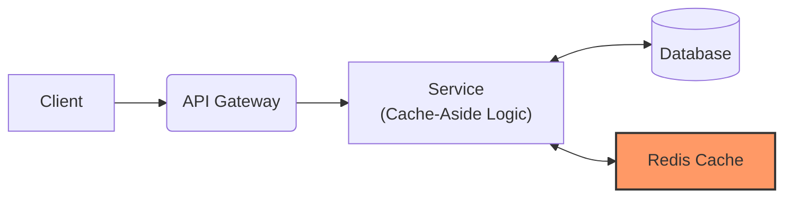
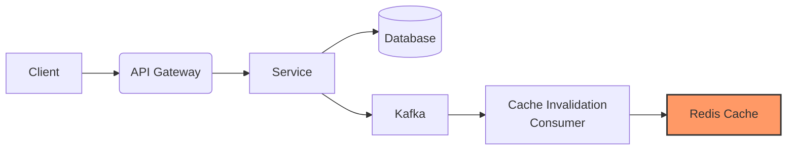

# Caching Strategy

This document describes the caching strategies used in EventFlow Commerce to improve performance and reduce database load.

### Data Flow Through Cache

**Read Path (Cache-Aside)**

**Write Path (Async Invalidation)**

