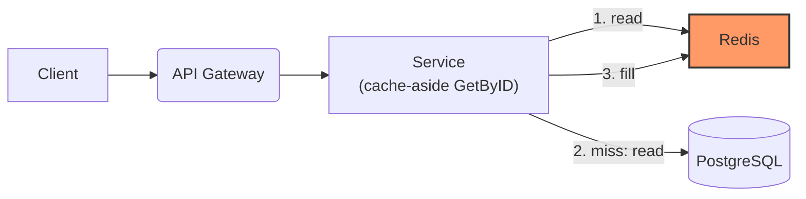
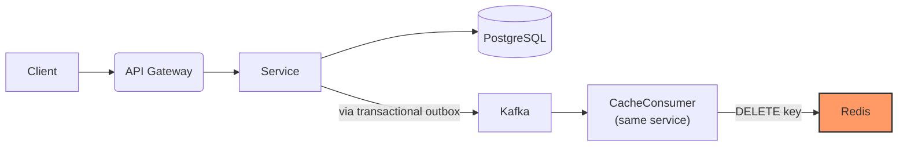

# Caching Strategy

Cache-aside reads over Redis for the order and inventory services, invalidated by consuming each
service's own domain events instead of a TTL alone, plus a longer-lived fallback entry that lets
inventory keep answering product reads after its database fails.

Implemented in `shared/libs/go/cache` (the Redis-backed cache-aside helper),
`services/inventory/internal/service/product.go` (product reads plus the stale fallback),
`services/order/internal/service/order.go` (order reads), and each service's
`internal/consumer/cache.go` (invalidation). The payment service does not cache: its reads go
through the `payment_status` projection, not the aggregate, so there is nothing slow to front with
a cache today.

### Read path (cache-aside)

```mermaid
flowchart LR
    style Cache fill:#f96,stroke:#333,stroke-width:2px

    Client --> GW(API Gateway)
    GW --> S["Service
(cache-aside GetByID)"]
    S -- "1. read" --> Cache[Redis]
    S -- "2. miss: read" --> DB[(PostgreSQL)]
    S -- "3. fill" --> Cache
```

A cache read that errors (Redis down) falls back to the database rather than failing the
request; a database read that errors after a cache miss is where the two services diverge, see
below.

### Write / invalidation path

Neither service invalidates the cache inline with the write that changed the data: the write
enqueues a domain event through the transactional outbox as usual, and each service's own
`CacheConsumer` deletes the affected key when that event comes back around on Kafka.

```mermaid
flowchart LR
    style Cache fill:#f96,stroke:#333,stroke-width:2px

    Client --> GW(API Gateway)
    GW --> S[Service]
    S --> DB[(PostgreSQL)]
    S -- "via transactional outbox" --> K[Kafka]
    K --> CC["CacheConsumer
(same service)"]
    CC -- "DELETE key" --> Cache[Redis]
```

- Inventory's `CacheConsumer` consumes `inventory.events` and deletes `product:<id>` for every
  product id carried by `product.updated`, `inventory.reserved` or `inventory.released`.
- Order's `CacheConsumer` consumes `orders.events` and deletes `order:<id>` for the order id
  carried by any event on the topic.
- Both run in their own Kafka consumer group (`inventory-cache`, `order-cache`), separate from the
  group the service's saga consumer uses, so the two subscriptions do not share offsets.

### Fallback on database failure (inventory only)

`ProductService.GetByID` writes every successful database read to two cache entries: the normal
`product:<id>` at a 5 minute TTL, and `product:<id>:fallback` at a 24 hour TTL. When the database
read fails after a cache miss, `GetByID` falls back to that longer-lived entry instead of failing
the request, and reports the result as stale (surfaced to callers as an `X-Cache: stale` response
header on `GET /api/v1/products/{id}`, see `docs/architecture/resilience.md`). The order service's
cache has no equivalent fallback: a database failure there still fails the read.
