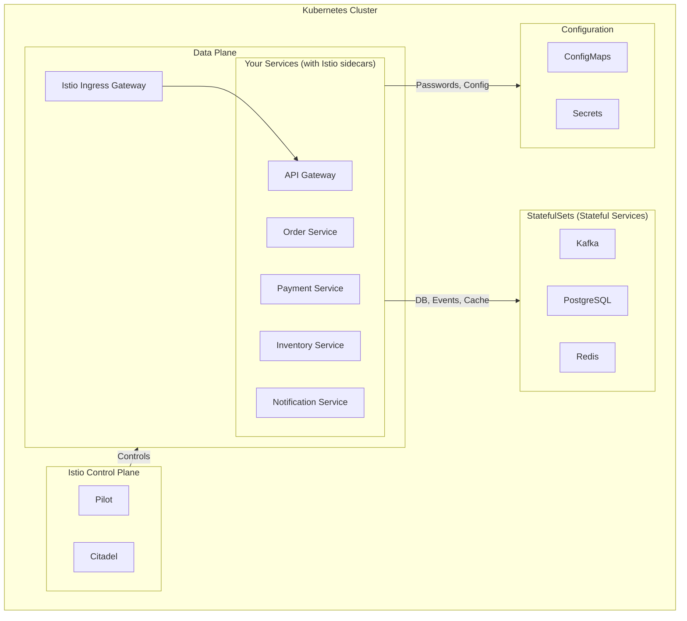

# Deployment Architecture

This document describes the deployment architecture of EventFlow Commerce on Kubernetes, using Istio as a service mesh.

```mermaid
graph TB
    subgraph "Kubernetes Cluster"
        subgraph IstioControlPlane ["Istio Control Plane"]
            direction LR
            Pilot[Pilot]
            Citadel[Citadel]
        end

        subgraph DataPlane ["Data Plane"]
            direction TB
            IIG["Istio Ingress Gateway"]

            subgraph DeploymentsGroup ["Your Services (with Istio sidecars)"]
                direction LR
                GW["API Gateway"]
                OS["Order Service"]
                PS["Payment Service"]
                IS["Inventory Service"]
                NS["Notification Service"]
            end
        end

        subgraph StatefulSetsGroup ["StatefulSets (Stateful Services)"]
            direction LR
            KAFKA["Kafka"]
            PG["PostgreSQL"]
            REDIS["Redis"]
        end

        subgraph ConfigGroup ["Configuration"]
            direction LR
            CM["ConfigMaps"]
            SEC["Secrets"]
        end
    end

    %% Connections
    IIG --> GW
    DeploymentsGroup -- "DB, Events, Cache" --> StatefulSetsGroup
    DeploymentsGroup -- "Passwords, Config" --> ConfigGroup
    IstioControlPlane -- "Controls" --> DataPlane
```
