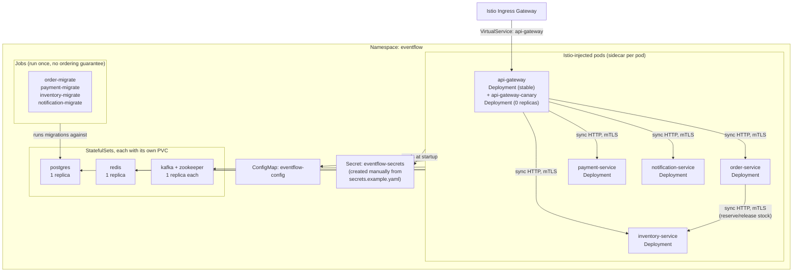

# Deployment Architecture

How EventFlow Commerce is laid out on Kubernetes with Istio as the service mesh: what runs as a
`Deployment` versus a `StatefulSet`, how configuration and secrets reach a pod, and where Istio
sits on the request path.

Implemented in `infrastructure/k8s/base` (the kustomize base every overlay patches),
`infrastructure/k8s/overlays/dev` and `infrastructure/k8s/overlays/prod` (replica counts, resource
sizing and logger settings for each environment), and `infrastructure/istio/` (the mesh
configuration layered on top). See [docs/guides/deployment.md](../guides/deployment.md) for the
commands that apply all of this, and [ADR-005](./adr/005-canary-releases-with-istio.md) for the
canary rollout the API Gateway's second Deployment exists for.

### Layout

### Notes on the layout

- Postgres, redis, zookeeper and kafka each run as a single-replica `StatefulSet` with its own
  `PersistentVolumeClaim`; nothing else in the base needs a stable network identity or its own
  volume, so every application service is a plain `Deployment`. `scripts/init-databases.sh` runs
  once, mounted into postgres as a ConfigMap, creating the four per-service databases and roles on
  first boot.
- Every application `Deployment` reads `eventflow-config` (a `ConfigMap`) and `eventflow-secrets`
  (a `Secret`) through `envFrom`. The `Secret` is deliberately not one of the base's kustomize
  resources: it is created by hand from `infrastructure/k8s/base/secrets.example.yaml`, so real
  credentials never enter the repository.
- The four migration `Jobs` in `infrastructure/k8s/base/migrations.yaml` are bundled into the same
  kustomize base as the application `Deployments`; nothing in Kubernetes orders a `Job` before a
  `Deployment`, so a pod may restart a few times against a not-yet-migrated database before its
  `Job` completes. `kubectl wait --for=condition=complete job -l eventflow.io/phase=migrate`
  confirms they finished.
- `overlays/dev` pins every `Deployment` to one replica and shrinks resource requests for a local
  cluster; `overlays/prod` raises the API Gateway and order service to three replicas (the two hops
  every request takes) and adds node anti-affinity for the rest.
- Istio's ingress gateway is the only entry point from outside the mesh
  (`infrastructure/istio/gateway.yaml`); `PeerAuthentication` enforces strict mTLS between every
  sidecar, and `AuthorizationPolicy` denies traffic by default, allowing only api-gateway from
  outside and only order-service to call inventory-service directly, matching the synchronous stock
  reservation in [saga-pattern.md](./saga-pattern.md).
- `HorizontalPodAutoscaler` only exists for api-gateway, order-service and payment-service
  (`infrastructure/k8s/base/hpa.yaml`), scaling 2 to 6 replicas on 70% CPU utilization;
  inventory-service and notification-service have no HPA yet. `PodDisruptionBudget` (`pdb.yaml`)
  covers all five, keeping at least one replica of each up during a voluntary disruption.
