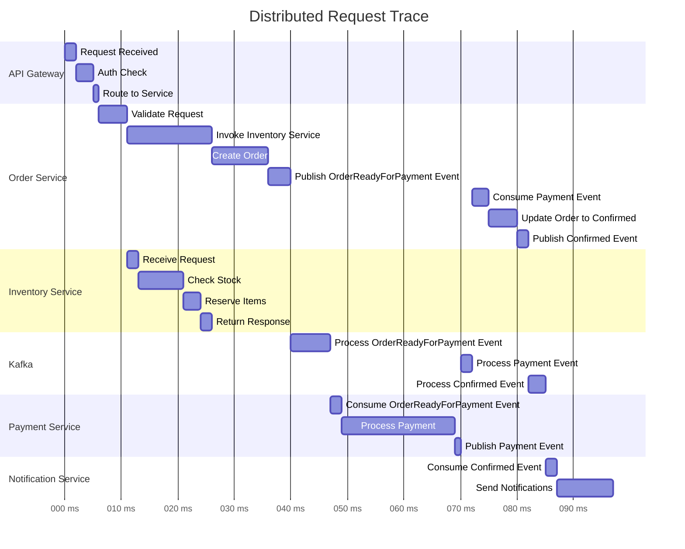

# Distributed Tracing

This document provides an example of a distributed trace for a typical user request.

### Distributed Tracing Example

```mermaid
gantt
    title Distributed Request Trace
    dateFormat x
    axisFormat %L ms

    section API Gateway
    Request Received                   : 0, 2
    Auth Check                         : 2, 5
    Route to Service                   : 5, 6

    section Order Service
    Validate Request                   : 6, 11
    Invoke Inventory Service             : 11, 26
    Create Order                       : 26, 36
    Publish OrderReadyForPayment Event : 36, 40
    Consume Payment Event              : 72, 75
    Update Order to Confirmed          : 75, 80
    Publish Confirmed Event            : 80, 82

    section Inventory Service
    Receive Request                    : 11, 13
    Check Stock                        : 13, 21
    Reserve Items                      : 21, 24
    Return Response                    : 24, 26

    section Kafka
    Process OrderReadyForPayment Event : 40, 47
    Process Payment Event              : 70, 72
    Process Confirmed Event            : 82, 85

    section Payment Service
    Consume OrderReadyForPayment Event : 47, 49
    Process Payment                    : 49, 69
    Publish Payment Event              : 69, 70

    section Notification Service
    Consume Confirmed Event            : 85, 87
    Send Notifications                 : 87, 97
```