# Distributed Tracing

How a trace actually propagates through EventFlow Commerce: continuously across HTTP and Kafka
within one hop, but not across the transactional outbox. Every service exports through the same
`OTEL_EXPORTER_OTLP_ENDPOINT` (see [ADR-004](./adr/004-otlp-instead-of-jaeger-thrift.md)).

Implemented in `shared/libs/go/tracing` (SDK setup and the W3C `tracecontext`/`baggage`
propagators), `shared/libs/go/events/tracing.go` (injecting and extracting trace context through
Kafka message headers) and `notification/tracing.py` (the same on the Python side).

### Where a span opens

- **HTTP server spans**: `otelhttp.NewHandler` wraps every service's handler chain
  (`api-gateway`, `order`, `payment`, `inventory`), naming the span by method and a route
  collapsed to its first three path segments so distinct order or product ids do not each mint a
  new span name.
- **HTTP client spans**: the API Gateway's reverse proxy transport and the order service's
  inventory client both use `otelhttp.NewTransport`, so `POST /api/v1/orders` on the gateway and
  the order service's synchronous `POST /api/v1/inventory/reservations` call both continue the
  same trace, parent to child. The order service's payment client (used for the refund call
  during compensation) does not wrap its transport, so that one HTTP hop currently opens no client
  span and propagates no trace header.
- **Kafka producer spans**: `events.Publisher.Publish` opens a span named `<topic> publish` and
  injects the current trace context into the message headers.
- **Kafka consumer spans**: `events.Subscriber` extracts whatever trace context a message's
  headers carry and opens `<topic> process` as its child (`SpanKindConsumer`), before the
  registered handler runs. The notification service's own consumer does the same
  (`notification/consumer.py`, `_extract_trace_context`).

### Where a trace breaks

A domain event is never published from the request that created it: it is written to
`outbox_messages` in the same transaction as the state change, and a separate relay publishes it
later on its own polling loop (see [ADR-002](./adr/002-transactional-outbox.md)). The relay calls
`Publish` from its own background context, not the original request's, so the producer span it
opens has no parent. In practice this means a saga does not appear as one continuous trace end to
end; it appears as one trace per hop between two synchronous points, each starting fresh at the
next outbox publish:

```mermaid
graph LR
    subgraph "Trace 1: the client's request"
        A["POST /api/v1/orders
(api-gateway -> order)"] --> B["POST /api/v1/inventory/reservations
(order -> inventory, sync HTTP)"]
        B --> C["Order saved,
outbox row enqueued"]
    end

    C -. "trace context lost here:
relay publishes on its own
background context" .-> D

    subgraph "Trace 2: starts at the relay's publish"
        D["orders.events publish
(order's outbox relay)"] --> E["orders.events process
(payment's OrdersConsumer)"]
        E --> F["Charge via stub gateway,
outbox row enqueued"]
    end

    F -. "trace context lost again" .-> G

    subgraph "Trace 3: starts at the next relay publish"
        G["payments.events publish
(payment's outbox relay)"] --> H["payments.events process
(order's PaymentsConsumer)"]
    end
```

A client following one order through Jaeger therefore has to look up each hop's trace separately;
there is currently no single trace id spanning the whole saga. Reconnecting them would need
carrying a value through `outbox_messages` and back out into the published event, which nothing
does today: `events.Event.CorrelationID` and `outbox.Message.CorrelationID` exist as fields, but
nothing in `services/order`, `services/payment` or `services/inventory` sets them from the
gateway's `X-Correlation-ID` header.
