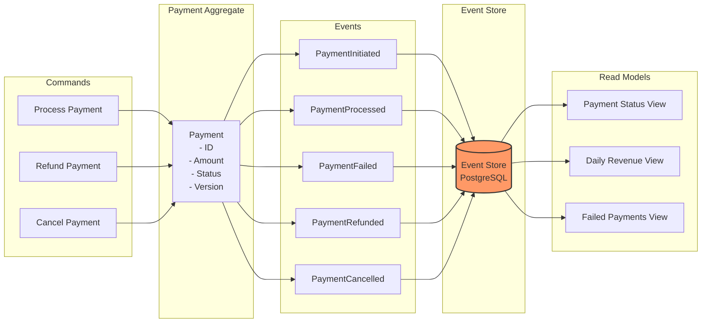
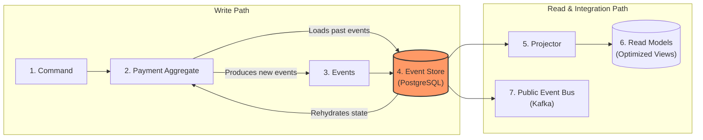

# Event Sourcing

This document describes the implementation of the Event Sourcing pattern in the Payment Service.

### Conceptual Overview

```mermaid
graph LR
    subgraph "Commands"
        CMD1[Process Payment]
        CMD2[Refund Payment]
        CMD3[Cancel Payment]
    end
    
    subgraph "Payment Aggregate"
        PA[Payment<br/>- ID<br/>- Amount<br/>- Status<br/>- Version]
    end
    
    subgraph "Events"
        E1[PaymentInitiated]
        E2[PaymentProcessed]
        E3[PaymentFailed]
        E4[PaymentRefunded]
        E5[PaymentCancelled]
    end
    
    subgraph "Event Store"
        ES[(Event Store<br/>PostgreSQL)]
    end
    
    subgraph "Read Models"
        RM1[Payment Status View]
        RM2[Daily Revenue View]
        RM3[Failed Payments View]
    end
    
    CMD1 --> PA
    CMD2 --> PA
    CMD3 --> PA
    
    PA --> E1
    PA --> E2
    PA --> E3
    PA --> E4
    PA --> E5
    
    E1 --> ES
    E2 --> ES
    E3 --> ES
    E4 --> ES
    E5 --> ES
    
    ES --> RM1
    ES --> RM2
    ES --> RM3
    
    style ES fill:#f96,stroke:#333,stroke-width:2px
```

### Implementation Details

```mermaid
graph LR
    subgraph "Write Path"
        direction LR
        CMD["1. Command"] --> AGG["2. Payment Aggregate"]
        AGG -- "Loads past events" --> ES
        ES[("4. Event Store<br/>(PostgreSQL)")] -- "Rehydrates state" --> AGG
        AGG -- "Produces new events" --> EV["3. Events"]
        EV --> ES
    end

    subgraph "Read & Integration Path"
        direction TB
        PROJ["5. Projector"]
        KAFKA["7. Public Event Bus<br/>(Kafka)"]
        RM[("6. Read Models<br/>(Optimized Views)")]
    end

    ES --> PROJ
    PROJ --> RM
    ES --> KAFKA

    style ES fill:#f96,stroke:#333,stroke-width:2px
```