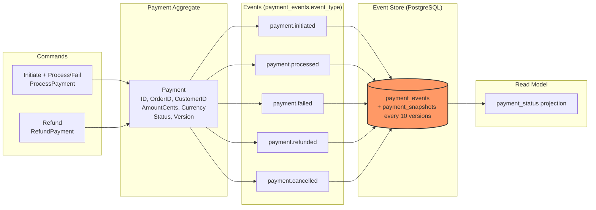
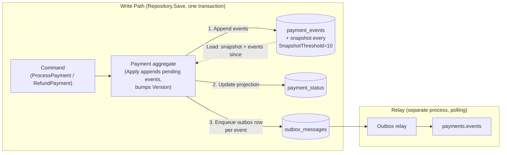

# Event Sourcing

How the payment service stores a payment as an append-only stream of events instead of a mutable
row, and how it keeps that stream, a queryable projection and the outbound Kafka event all
consistent with each other. See [ADR-003](./adr/003-event-sourcing-in-payments.md) for why.

Implemented in `services/payment/internal/domain` (the aggregate and its events),
`services/payment/internal/eventstore` (the event store, snapshots and the repository that ties
them together with the projection and the outbox), and `services/payment/internal/projection`
(the `payment_status` read model).

### Conceptual overview

`domain.Payment.Cancel` and the `payment.cancelled` event exist in the domain model but nothing
in the current codebase calls `Cancel`; only initiate/process/fail and refund are reachable
through the HTTP API.

### Write path

A single call to `ProcessPayment` produces two pending events on the aggregate, not one:
`Initiate` always appends `payment.initiated`, and the gateway result then appends either
`payment.processed` or `payment.failed`. `Repository.Save` persists all of an aggregate's pending
events in one database transaction:

`Repository.Load` rebuilds an aggregate for a command by reading its latest snapshot (if any) and
replaying every event recorded since. `GET /api/v1/payments/{id}/events` exposes the raw stream
for audit; `GET /api/v1/payments/{id}` and `GET /api/v1/payments` read `payment_status` instead of
replaying events on every request, since replay cost only matters on the write path where the
aggregate must be reloaded to accept the next command.
