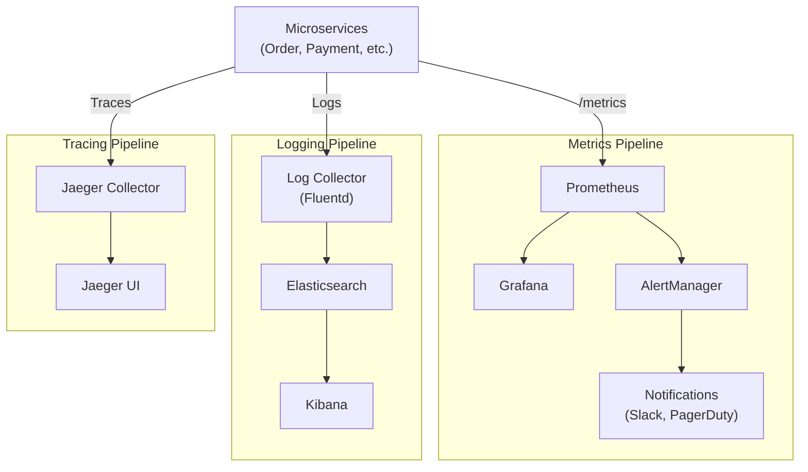

# Observability

This document describes the observability stack for EventFlow Commerce, covering metrics, logging, and tracing.

### Observability (Monitoring, Logging & Tracing)

```mermaid
graph TB
    SVC["Microservices<br>(Order, Payment, etc.)"]

    subgraph "Metrics Pipeline"
        PROM["Prometheus"] --> GRAF["Grafana"]
        PROM --> AM["AlertManager"] --> NOTIFY["Notifications<br>(Slack, PagerDuty)"]
    end

    subgraph "Logging Pipeline"
        LC["Log Collector<br>(Fluentd)"] --> ES["Elasticsearch"]
        ES --> KIB["Kibana"]
    end

    subgraph "Tracing Pipeline"
        JC["Jaeger Collector"] --> JAEGER_UI["Jaeger UI"]
    end

    SVC -- "/metrics" --> PROM
    SVC -- "Logs" --> LC
    SVC -- "Traces" --> JC
```