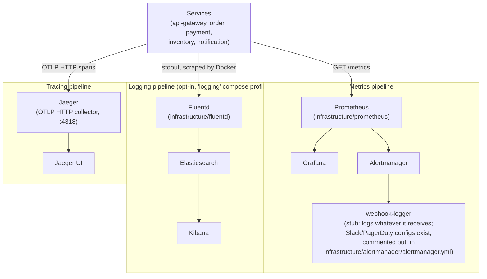

# Observability

Metrics, logs and traces for EventFlow Commerce: what each service emits, where it goes, and
which parts of the pipeline are stubs standing in for a real destination.

### Metrics, logs and traces

### Metrics

Every service exposes `/metrics` in Prometheus text format; `infrastructure/prometheus/prometheus.yml`
scrapes all five every 30s, plus `postgres-exporter`, `redis-exporter` and `kafka-exporter` every
60s for the infrastructure Postgres and Redis do not expose natively. Application metrics come
from `shared/libs/go/metrics` (HTTP request counts and latency, database pool stats),
`shared/libs/go/events` (Kafka publish/consume/DLQ counts, outbox backlog),
`shared/libs/go/resilience` (`circuit_breaker_state`, `circuit_breaker_failures_total`) and
`shared/libs/go/cache` (hit/miss counts); the notification service exposes its own metrics through
`prometheus_client`'s ASGI app mounted at the same path. `infrastructure/prometheus/rules/alerts.yml`
defines the alerting rules Alertmanager routes on severity; `make demo` brings up Prometheus,
Grafana and Alertmanager, wired to the stub `webhook-logger` receiver so alerts are visible without
a real paging channel configured.

### Logs

Every service logs structured JSON to stdout (`zap` for the Go services, the standard `logging`
module for notification, both configured in `*_LOGGER_ENVIRONMENT`/`ENVIRONMENT`). Shipping those
logs to Elasticsearch is opt-in: `elasticsearch`, `kibana` and `fluentd` all sit behind the
`logging` Compose profile, so `make demo` does not start them and there is nothing in Kibana until
`make logging-up` brings the profile up separately. Fluentd tails the host's Docker container logs
directly (`infrastructure/fluentd`), it does not receive a forwarded stream from each service.

### Traces

See [Distributed Tracing](./distributed-tracing.md) and [ADR-004](./adr/004-otlp-instead-of-jaeger-thrift.md)
for how a trace is propagated across HTTP and Kafka and why it goes out as OTLP rather than
Jaeger's original Thrift protocol.
