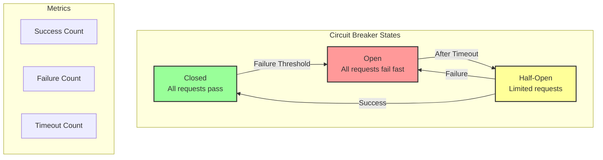
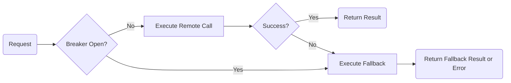

# Resilience Patterns

This document describes the resilience patterns used in EventFlow Commerce, focusing on the Circuit Breaker pattern.

### Error Handling & Circuit Breaker

**State Machine**

**Execution Flow with Fallback**

