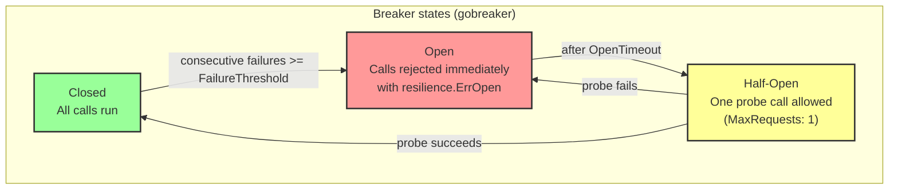
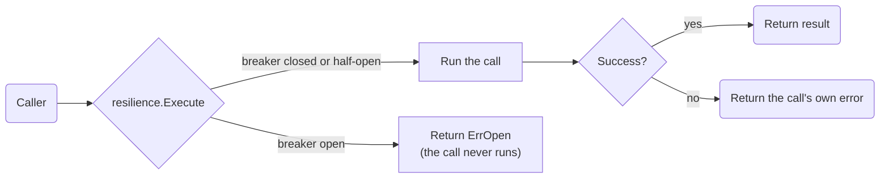

# Resilience Patterns

Circuit breakers around every synchronous call from one service to another, a jittered retry
helper for the calls that are safe to repeat, and a stale-cache fallback for inventory's product
reads. There is no separate "fallback" abstraction: each caller decides what to do when a breaker
is open, which is usually to fail fast with a clear error rather than hang on a dependency that is
already unhealthy.

Implemented in `shared/libs/go/resilience` (`Breaker`, wrapping
[`sony/gobreaker/v2`](https://github.com/sony/gobreaker), and `Retry`), used by
`services/api-gateway/internal/handler/router.go` (one breaker per backend), `services/order/internal/client`
(one breaker each for the inventory reserve, inventory release and payment refund calls) and
`services/payment/internal/gateway/client.go` (guarding the stub payment gateway call).

### Circuit breaker state machine

```mermaid
graph TB
    subgraph "Breaker states (gobreaker)"
        CLOSED["Closed
All calls run"]
        OPEN["Open
Calls rejected immediately
with resilience.ErrOpen"]
        HALF["Half-Open
One probe call allowed
(MaxRequests: 1)"]
    end

    CLOSED -->|"consecutive failures >= FailureThreshold"| OPEN
    OPEN -->|"after OpenTimeout"| HALF
    HALF -->|"probe succeeds"| CLOSED
    HALF -->|"probe fails"| OPEN

    style CLOSED fill:#9f9,stroke:#333,stroke-width:2px
    style OPEN fill:#f99,stroke:#333,stroke-width:2px
    style HALF fill:#ff9,stroke:#333,stroke-width:2px
```

`circuit_breaker_state` and `circuit_breaker_failures_total` (both labeled by breaker `name`) are
Prometheus metrics emitted by every `Breaker` regardless of which service constructs it.

### Call flow through a breaker

```mermaid
flowchart LR
    A(Caller) --> B{"resilience.Execute"}
    B -- "breaker closed or half-open" --> C[Run the call]
    C --> D{Success?}
    D -- "yes" --> E(Return result)
    D -- "no" --> F(Return the call's own error)
    B -- "breaker open" --> G["Return ErrOpen
(the call never runs)"]
```

What a caller does with an open breaker differs by call site:

- The API Gateway answers the client with `503 SERVICE_UNAVAILABLE` immediately
  (`Router.writeCircuitOpenResponse`), without forwarding the request to the unhealthy backend.
- The order service's inventory and payment clients wrap `ErrOpen` into the same `AppError` shape
  a normal HTTP failure would produce (`INVENTORY_SERVICE_UNAVAILABLE`,
  `PAYMENT_SERVICE_UNAVAILABLE`), so callers only ever see one error shape regardless of whether
  the backend rejected the request or the breaker did.
- The payment gateway stub declines the charge with `gateway_unavailable` instead of returning an
  error at all, so an open breaker looks like an ordinary decline to `ProcessPayment`, not a
  system failure.

### Retry

`resilience.Retry` retries a function with exponential backoff and full jitter, bounded by
`MaxAttempts`, `BaseDelay` and `MaxDelay`, and an optional `Retryable` predicate that stops
retrying an error it does not consider transient. It is only used where the call is safe to run
again:

- Releasing a stock reservation and refunding a payment are both retried, since redelivering
  either is a no-op on the receiving side.
- Reserving stock is guarded by a breaker but never retried: without an idempotency key, retrying
  after an ambiguous failure (timeout, dropped response) risks reserving the same order twice.

`Retryable` on both order clients treats an open breaker and any `AppError` below `500` as
non-retryable, so a rejected request (a `4xx`) fails immediately instead of being retried into the
same rejection.

### Fallback: stale cache reads

Inventory's product cache keeps a longer-lived fallback entry precisely so `GetByID` has
something to fall back to when the database itself fails, rather than the caller getting an
error; see [Caching Strategy](./caching.md) for the read path and TTLs.
