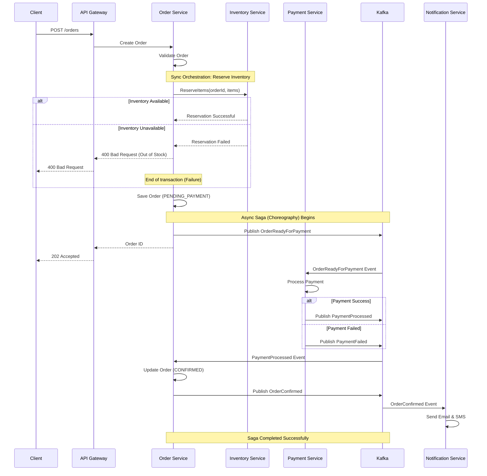
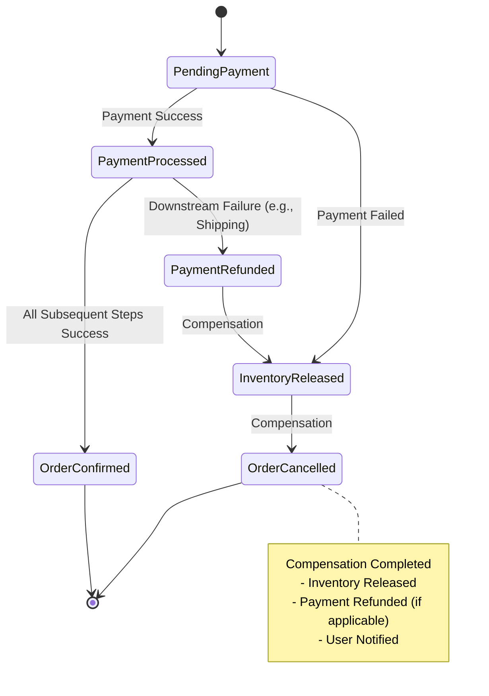

# Saga Pattern

This document describes the implementation of the Saga pattern for handling distributed transactions in EventFlow Commerce.

### Order-Saga Flow

```mermaid
sequenceDiagram
    participant C as Client
    participant GW as API Gateway
    participant OS as Order Service
    participant IS as Inventory Service
    participant PS as Payment Service
    participant K as Kafka
    participant NS as Notification Service

    C->>GW: POST /orders
    GW->>OS: Create Order
    OS->>OS: Validate Order

    Note over OS, IS: Sync Orchestration: Reserve Inventory
    OS->>IS: ReserveItems(orderId, items)
    alt Inventory Available
        IS-->>OS: Reservation Successful
    else Inventory Unavailable
        IS-->>OS: Reservation Failed
        OS-->>GW: 400 Bad Request (Out of Stock)
        GW-->>C: 400 Bad Request
        Note over OS: End of transaction (Failure)
    end

    OS->>OS: Save Order (PENDING_PAYMENT)
    
    Note over OS, K: Async Saga (Choreography) Begins
    OS->>K: Publish OrderReadyForPayment
    OS-->>GW: Order ID
    GW-->>C: 202 Accepted

    K->>PS: OrderReadyForPayment Event
    PS->>PS: Process Payment
    alt Payment Success
        PS->>K: Publish PaymentProcessed
    else Payment Failed
        PS->>K: Publish PaymentFailed
    end

    K->>OS: PaymentProcessed Event
    OS->>OS: Update Order (CONFIRMED)
    OS->>K: Publish OrderConfirmed

    K->>NS: OrderConfirmed Event
    NS->>NS: Send Email & SMS

    Note over OS, K: Saga Completed Successfully
```

### Saga Compensation Flow

```mermaid
stateDiagram-v2
    [*] --> PendingPayment

    PendingPayment --> PaymentProcessed: Payment Success
    PendingPayment --> InventoryReleased: Payment Failed

    PaymentProcessed --> OrderConfirmed: All Subsequent Steps Success
    PaymentProcessed --> PaymentRefunded: Downstream Failure (e.g., Shipping)

    InventoryReleased --> OrderCancelled: Compensation
    PaymentRefunded --> InventoryReleased: Compensation

    OrderConfirmed --> [*]
    OrderCancelled --> [*]

    note right of OrderCancelled
        Compensation Completed
        - Inventory Released
        - Payment Refunded (if applicable)
        - User Notified
    end note
```