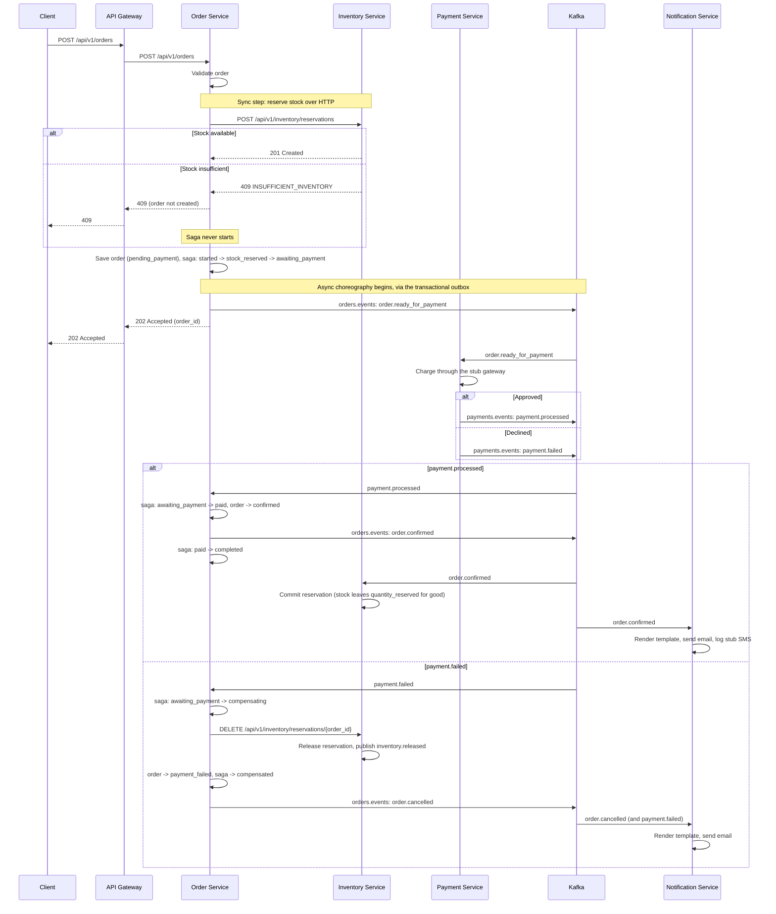
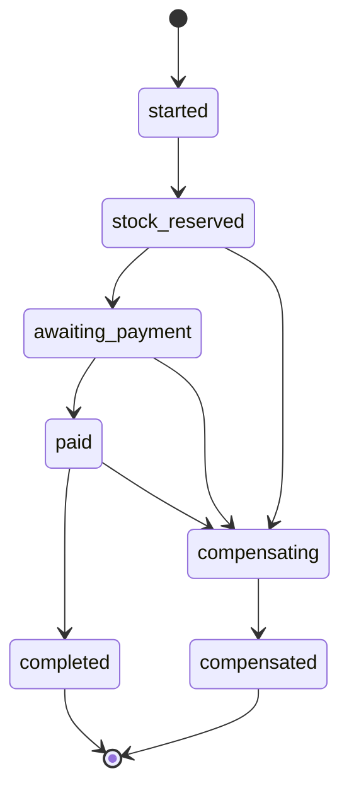

# Saga Pattern

How EventFlow Commerce keeps an order, its stock reservation and its payment consistent across
three services without a distributed transaction: a synchronous reservation step followed by a
choreographed saga over Kafka, with a state machine in the order service driving compensation
when a later step fails.

Implemented in `services/order/internal/service/order.go` (the saga's transitions),
`services/order/internal/saga` (the state graph), `services/order/internal/consumer/payments.go`
(reacting to payment outcomes), `services/payment/internal/consumer/orders.go` (charging on
`order.ready_for_payment`) and `services/inventory/internal/consumer/orders.go` (committing or
releasing a reservation once an order's outcome is known). Every event is published through the
transactional outbox (see [ADR-002](./adr/002-transactional-outbox.md)), not directly from
business code.

### Order-Saga Flow

The event catalog has no dedicated "payment failed" order event: a failed payment and an
explicit cancellation both end the saga through `order.cancelled`, so anything downstream treats
them the same way. Both the order and inventory consumers record every event they act on in a
`processed_events` table before applying it, in the same transaction as the state change, so a
redelivered message is a no-op rather than a duplicate reservation release or a double payment
charge (payment's own charge path is additionally idempotent by order id, since it cannot mark its
inbound event processed in the same transaction as the event-sourced write, see
`services/payment/internal/consumer/orders.go`).

### Saga states

`order_sagas.state` (`services/order/migrations/000004_add_order_sagas.up.sql`) tracks the saga
alongside its order:

The graph itself lives in `services/order/internal/saga/state.go` and is enforced by
`saga.CanTransition` on every write; a transition to the state a saga is already in is always
allowed, so retrying a step that already landed is a no-op. `OrderService.FailAfterPayment`
implements the reverse-order compensation for a saga that fails after payment already succeeded
(refund the payment, release the reservation, cancel the order), matching what the state graph
allows from `paid`, but nothing in the current codebase calls it yet: there is no later step after
`order.confirmed` that can fail today, so this path is reachable in code but not yet wired to any
event.
