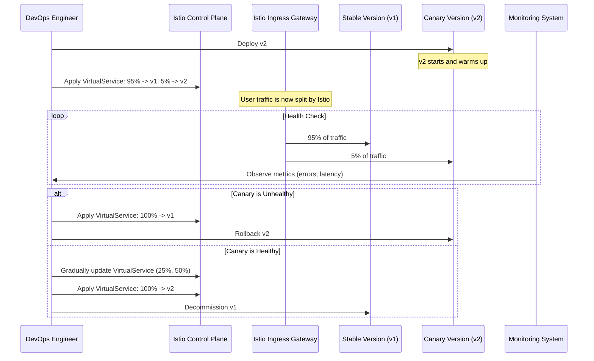

# Zero-Downtime Deployment (Canary Release)

This document describes the Canary Release strategy used for zero-downtime deployments.

### Canary Release Flow

```mermaid
sequenceDiagram
    participant Operator as DevOps Engineer
    participant Istio as Istio Control Plane
    participant Gateway as Istio Ingress Gateway
    participant Stable as Stable Version (v1)
    participant Canary as Canary Version (v2)
    participant Monitor as Monitoring System

    Operator->>Canary: Deploy v2
    Note over Canary: v2 starts and warms up

    Operator->>Istio: Apply VirtualService: 95% -> v1, 5% -> v2
    Note over Gateway: User traffic is now split by Istio

    loop Health Check
        Gateway->>Stable: 95% of traffic
        Gateway->>Canary: 5% of traffic
        Monitor->>Operator: Observe metrics (errors, latency)
    end

    alt Canary is Unhealthy
        Operator->>Istio: Apply VirtualService: 100% -> v1
        Operator->>Canary: Rollback v2
    else Canary is Healthy
        Operator->>Istio: Gradually update VirtualService (25%, 50%)
        Operator->>Istio: Apply VirtualService: 100% -> v2
        Operator->>Stable: Decommission v1
    end
```
