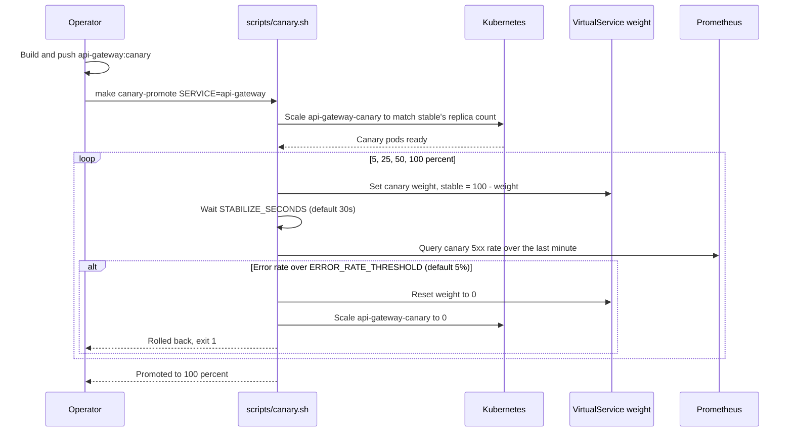

# Zero-Downtime Deployment

How a new version reaches production traffic without a visible gap: a canary rollout for the API
Gateway, and rolling updates with a `PodDisruptionBudget` for everything else. See
[ADR-005](./adr/005-canary-releases-with-istio.md) for why only the gateway has a canary rollout
today.

Implemented in `infrastructure/k8s/base/api-gateway-canary.yaml` (the canary `Deployment`),
`infrastructure/istio/virtual-services.yaml` and `destination-rules.yaml` (the weighted route and
the `stable`/`canary` subsets every service has), `scripts/canary.sh` (drives the rollout), and
`infrastructure/k8s/base/pdb.yaml` (keeps a rolling update of any other service from taking every
replica down at once). See [docs/guides/deployment.md](../guides/deployment.md) for the exact
commands.

### Canary rollout (API Gateway)

`scripts/canary.sh rollback api-gateway` (`make canary-rollback SERVICE=api-gateway`) runs the same
reset on demand, and `scripts/canary.sh set api-gateway <weight>` patches an explicit weight for
manual control between the automated steps.

### Everything else: rolling updates

Order, payment, inventory and notification have no canary `Deployment`: a new version replaces the
old one through the `Deployment`'s own `RollingUpdate` strategy. Two things keep this safe:

- `PodDisruptionBudget` (`infrastructure/k8s/base/pdb.yaml`) sets `minAvailable: 1` for every
  service, so a voluntary disruption (a node drain, a rollout) cannot take every replica of a
  service down at once, even under `overlays/dev`'s single-replica sizing where the budget has no
  spare capacity to enforce.
- `/health/live` and `/health/ready` back each `Deployment`'s liveness and readiness probes, so a
  pod that starts but cannot reach postgres, redis or kafka never receives traffic; the rollout
  waits for the new pods to actually be ready before finishing.

Every service's `DestinationRule` already defines a `stable` and `canary` subset by the `version`
pod label (see [ADR-005](./adr/005-canary-releases-with-istio.md)), so extending the canary
rollout to another service means adding its own `-canary` `Deployment` and a weighted route,
following `api-gateway-canary.yaml` as the template; nothing about the mesh configuration has to
change first.
